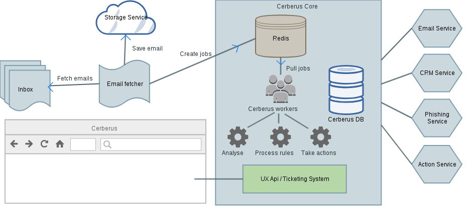

# cerberus-core #

## Summary ##

Cerberus is a toolkit to receive, parse, process and automate abuse reports handling received by ISP or hosting providers.
This toolkit includes an email fetcher, parsers, a business rules engine and a ticketing system.


## Setup ##

This project is mainly based on **Django**, **Flask**, **RQ** and **Rq-Scheduler**. To setup cerberus-core, you'll need:

 * A Linux environment
 * Python 2.7+
 * A PostgreSQL database (9.4.x or greater)
 * A Redis server

When all of these requirements are met, you can checkout the sources and install Cerberus:

    $ virtualenv venv
    $ source venv/bin/activate
    $ pip install --upgrade pip setuptools
    $ pip install -r requirements.txt

## Running ##

    $ python main.py

    Usage: main.py [OPTIONS] COMMAND [ARGS]...

      Cerberus CLI

    Options:
      --version  Show the flask version
      --help     Show this message and exit.

    Commands:

      add-rule         Add or update a Cerberus rule from file.
      fetch-email      Runs Cerberus email fetcher.
      initdb           Init Cerberus database.
      run              Runs a development server.
      run-worker       Runs a Cerberus worker.
      shell            Runs a shell in the app context.
      test             Runs tests.
      ticket-workflow  Runs Cerberus ticket workflow.

First, you need to init the database

    $ APP_ENV=dev APP_SETTINGS=settings-sample.yml python main.py initdb

Check if database is correctly populated

    $ APP_ENV=dev APP_SETTINGS=settings-sample.yml python main.py shell

    In [4]: from abuse.models import Category
    In [5]: list(Category.all().values_list('name', flat=True))
    Out[5]:
    [u'Copyright',
     u'Illegal',
     u'Intrusion',
     u'Malware',
     u'Network Attack',
     u'Other',
     u'Phishing',
     u'Spam']

To run Cerberus, you need at least to run these `main.py` commands:

- `run` for the API
- `run-worker --queues default,email` to run a worker
- `fetch-email` to fetch abuse emails
- `ticket-workflow` to update tickets status

The whole project uses `python-rq` and `rq-scheduler`. You can see jobs status with:

    $ rq-info

Start the scheduler:

    $ rqscheduler &

## Overview ##



## Business rules ? (aka workflows) ##

A rule contains `conditions` and `actions`. If all `conditions` are met, then `actions` are executed sequentially.

Cerberus business rules engine is based on [https://github.com/venmo/business-rules](https://github.com/venmo/business-rules)
You can find business rules example in `abuse/rules/definitions`.

Phishing rule example:

```yaml
config:
    actions:
    -   name: set_ticket_phishtocheck
    conditions:
        all:
        -   name: has_defendant
            operator: is_true
            value: true
        -   name: report_category
            operator: equal_to
            value: phishing
        -   name: urls_down
            operator: is_false
            value: true
        -   name: has_urls
            operator: is_true
            value: true
name: phishing_phishtocheck
orderId: 22 # lower number means higher priority
rulesType: Report
```

### Implementing your own business rules functions ###

You can add your own business rules variables and actions. Only requirement is that a function's name need to be unique.
For example, in `abuse.rules.variables.report`, add `myvar.py`:

```python
from ...engine.variables import boolean_rule_variable, BaseVariables

class MyVariables(BaseVariables):
    """
        This class implements My variables getters
        for rules engine
    """
    def __init__(self, parsed_email, report, ticket, is_trusted=False):
        """
            :param `cerberus.parsers.ParsedEmail` parsed_email: The parsed email
            :param `abuse.models.Report` report: A Cerberus report instance
            :param `abuse.models.Ticket` ticket: A Cerberus ticket instance
            :param bool is_trusted: if the report is trusted
        """
        self.report = report
        self.ticket = ticket

    @boolean_rule_variable(label='Check if report category is Phishing')
    def is_report_phishing(self):

        return self.report.category.lower() == 'phishing'
```

Now you can register variables definitions in your settings:

```yaml
RULES:
    variables:
        report:
            - 'abuse.rules.variables.report.default.DefaultReportVariables'
            - 'abuse.rules.variables.report.myvar.MyVariables'
```

## Customisation ##

### Implementing your own Services ###

Cerberus uses many `services`. You can rewrite/override default implementation of services.
Required services implementations are:

 * abuse.services.action.ActionServiceBase
 * abuse.services.crm.base.CRMServiceBase
 * abuse.services.email.base.EmailServiceBase
 * abuse.services.phishing.base.PhishingServiceBase
 * abuse.services.storage.base.StorageServiceBase

Optional, but usefull, are:

 * abuse.services.kpi.base.KPIServiceBase
 * abuse.services.reputation.base.ReputationServiceBase
 * abuse.services.search.base.SearchServiceBase

Then, tell Cerberus to use this implementation by editing IMPLEMENTATIONS in your settings file.

```yaml
IMPLEMENTATIONS:
    EmailServiceBase:
        class: 'abuse.services.email.myemailservice.MyEmailService'
```

Services are called through a singleton for each service. For example:

```python
from abuse.services.email import EmailService

emails = EmailService.get_emails(ticket)
```

will now execute your own `get_emails` implementation.

### Implementing your own async tasks ###

For example if you insert `rq` jobs from external API, Kafka messages ...

Simply put source files in `abuse.tasks`.

	$ tree abuse/tasks/
		abuse/tasks/
		├── __init__.py
		├── action.py
		├── defendant.py
		├── helpers.py
		├── masscontact.py
		├── **mytasks.py**
		├── phishing.py
		├── report.py
		└── ticket.py

## Project structure ##

 * `abuse/api`: Cerberus API for cerberus-ux.
 * `abuse/controllers`: API controllers.
 * `abuse/commands`: Cerberus main commands (run server, workers ...).
 * `abuse/models`: Django app models description.
 * `abuse/parsers`: email parsing engine and templates.
 * `abuse/rules`: business rules engine and rules definitions.
 * `abuse/services`: services used by Cerberus core functions.
 * `abuse/tasks`: tasks handled by python-rq workers.
 * `abuse/utils`: some utils functions.

## Definitions ##

- Plaintiff

(Legal) A person who brings a civil action in a court (aka claimant).

- Defendant

(Legal) A person or entity against whom an action or claim is brought in a court of law.
It is one of your customer who is suspected of illegal activities on his service(s).

- Service

A Defendant has suscribed to one or more services(s) (product(s)) your company offers. It can be ADSL, hosting, email services ...

- Provider

The source of the email. It can be directly the plaintiff or an representative third party.

- Report

One Provider + one Category. If a defendant is identified, the report is linked to a defendant, a service and contains item(s).

An email can generates one or more reports (if multiple defendants are identified). These reports can be attached to existing ticket, create one or just do nothing (depending on rules you have defined). So tickets can have multiple reports/providers.

So **not all reports are attached to tickets**. It's important, operators **process tickets, not reports**.

All the effective jobs are done with ticket: customer interaction (emails), action on service ...

- Ticket

One or more reports + one Category. It cans bel linked to a defendant/service, so all reports themselves linked to this defendant/service.

- Item

Fraudulent URL/IP/FQDN found in an email.

## Tests ##

Common tests:

    $APP_ENV=test APP_SETTINGS=abuse/tests/settings-test.yml python main.py test --pattern="test_*"
